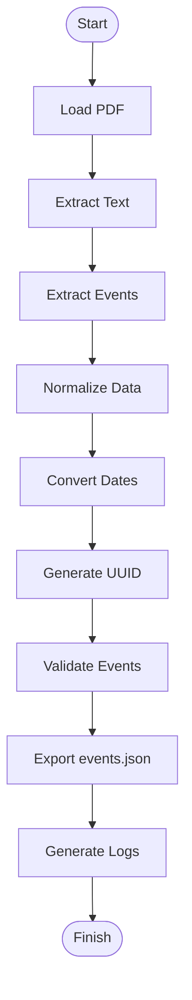

# Academic Calendar Event Extractor

## Project Description
The Academic Calendar Event Extractor is a robust Python-based tool designed to automate the extraction of academic events from PDF calendar documents. The application scans multi-page PDFs, dynamically crops headers and footers, detects tabular event structures, and maps the data (Title, Date, Description, Department, and Audience) into a highly strict Pydantic validation schema. Each event is assigned a unique UUID4 and formatted to ensure perfect downstream data integrity. Duplicate, corrupted, and invalid data are gracefully discarded and heavily logged.

## Installation
1. Ensure you have Python 3.10+ installed on your system.
2. Clone or download the project directory.
3. Install the dependencies via pip:
```bash
pip install -r requirements.txt
```

## Required Libraries
This project relies on the following libraries:
- `pdfplumber` - Advanced table and text extraction from PDFs.
- `PyMuPDF` (`fitz`) - Lightweight and extremely fast fallback PDF processor.
- `pydantic` - Strict data validation and schema definition.
- `python-dateutil` - Fuzzy date parsing and standardization across varying formats.

## How to Run
Execute the main entry point via the command line:
```bash
python extract_events.py --pdf path/to/your/calendar.pdf --output events.json
```
If you do not specify arguments, it defaults to:
- **Input:** `academic_calendar.pdf` (in the root directory)
- **Output:** `events.json`

## Input
The script accepts standard multi-page PDF academic calendars. It intelligently parses both raw text strings and complex table grids, isolating relevant dates and strings.

## Output
The primary output is a UTF-8 encoded JSON array of objects (saved in `events.json` by default). Each object guarantees the following strict schema:
- `event_id` (UUID4 string)
- `date` (YYYY-MM-DD strict format)
- `title` (String)
- `description` (String)
- `department` (String - Defaults to "ALL")
- `audience` (String - "all_students" or "dept_only")

The tool also dynamically generates `extractor.log`, chronicling every page read, validation error, skipped duplicate, and system failure.

## Folder Structure
```text
AcademicCalendarExtractor/
│
├── academic_calendar.pdf    # Default Input PDF
├── extract_events.py        # Main execution pipeline
├── parser.py                # Regex extraction and date standardizer 
├── validator.py             # Pydantic data schemas and strict validation
├── utils.py                 # Multi-tool PDF parsing and fallback mechanisms
├── config.py                # Default global variables and paths
├── requirements.txt         # Dependencies
├── README.md                # Documentation
├── extractor.log            # Automated execution and error logs
└── events.json              # Default Extracted JSON payload
```

## Execution Flow


